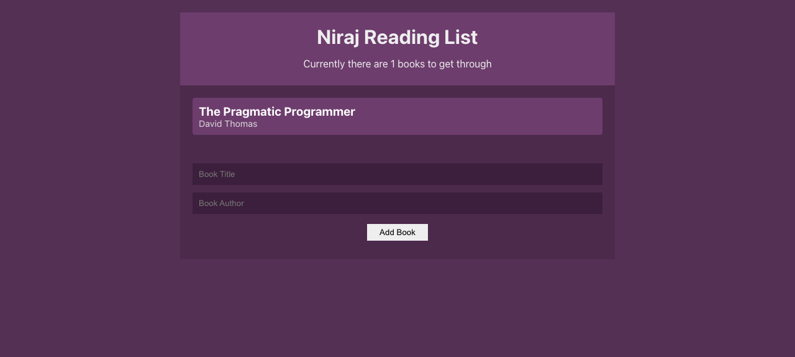

# Niraj Books (Book Keeper App)

Keep track of the books you plan to read. Add a book with its author, and click a book to mark it read (remove it from the list). State is managed with React's Context API and `useReducer`, and persisted to `localStorage`.



## Tech stack

React (Context API, useReducer, hooks), localStorage for persistence

## How to run

```bash
npm install
npm start
```

Runs the app at http://localhost:3000.

## Developer

Niraj Kafle — kafleniraj@gmail.com

## License

[MIT](LICENSE)
